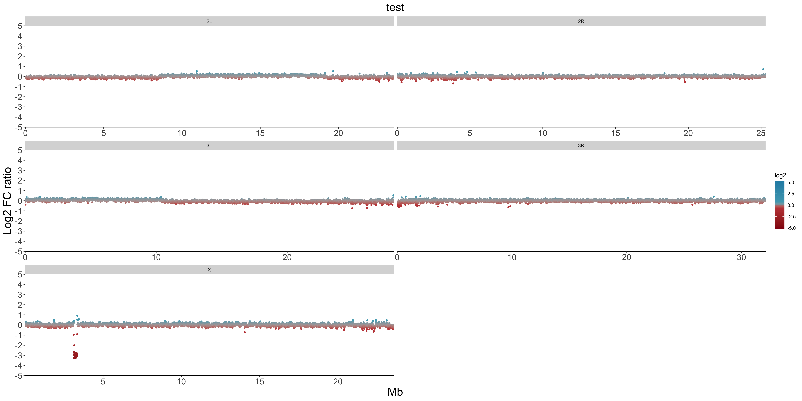

[](https://mybinder.org/v2/gh/nriddiford/cnvPlotteR/master)

# Plotting functions for CNV data

## Installation

Install from github:

```
git clone https://github.com/nriddiford/cnvPlotteR.git
```

Start an R session, and install package:

```{R}
library(devtools)
install_github("nriddiford/cnvPlotteR")
library(cnvPlotteR)
```
## Plot Control Freec normalised CNs

The function `freecPlot` will plot all CNs for for all chromosomes (if using a non-Drosophila genome the variables `chroms` and `autosomes` should be adjusted accordingly). Sub-clonal CNs are highlighted too.   


```{R}
file.names <- dir("data/freec", pattern = ".txt")
for (f in file.names){
  freecPlot(cnv_file=paste("data/freec/",f, sep=''))
}
```

## Other plotting functions are for CNV-Seq output

* Designed to read output from [CNV-Seq](http://tiger.dbs.nus.edu.sg/cnv-seq/doc/manual.pdf), although should work for any coverage data with cols:

"chromosome"
"start" - 1-based window start
"end" - 1-based window end
"test" - number of reads mapped in window in tumour sample
"ref" - number of reads mapped in window in normal sample
"position" - (end - start) +1
"log2" - log2 FC for tumour/normal reads per window

Example output from CNV-Seq:

```
"chromosome"    "start" "end"   "test"  "ref"   "position"      "log2"  "p.value"       "cnv"   "cnv.size"      "cnv.log2"      "cnv.p.value"
"X"     1       10000   50      74      5000    -0.292601981038923      2.85779196291872e-06    0       NA      NA      NA
"X"     5001    15000   50      72      10000   -0.253073616852285      4.12598434147092e-05    0       NA      NA      NA
"X"     10001   20000   2       2       15000   0.272995194815302       7.96882592007325e-06    0       NA      NA      NA
"X"     15001   25000   0       0       20000   NA      NA      0       NA      NA      NA
"X"     20001   30000   0       0       25000   NA      NA      0       NA      NA      NA
"X"     25001   35000   0       0       30000   NA      NA      0       NA      NA      NA
"X"     30001   40000   0       0       35000   NA      NA      0       NA      NA      NA
```

### Plot all cnvs in specified directory for all chromosomes

* Currently assumes *Drosophila* genome, and excludes chroms 4 and Y for grid plot. Will look for .cnv files in 'data/' unless alternative path provided

```
allPlot(path = 'path/to/cnv_files/')
````



### Plot single chromosome

* Will default to plotting X chromosome if `chrom` not specified

```
chromPlot(cnv_file = "data/test.window-10000.cnv")
```

* Plot all chroms for all files:

```{R}
file.names <- dir("data/", pattern = ".cnv")

for (f in file.names){
  for (c in c("2L", "2R", "3L", "3R", "X")){
    chromPlot(chrom=c, cnv_file=paste("data/cnvs/",f, sep=''))
  }
}
```

### Plot region for specified chromosome

* Will by default plot region around N on X if no `to` or `from` specified

```
 regionPlot(cnv_file="data/w500/test.window-500.cnv", from=3050000, to=3450000, chrom="X", ylim=c(-7,7), bp1=3129368,bp2=3352041, tick=100000, title="222Kb DEL on X")
 ```

### Plot coverage for all '.count' files

* Use defaults: readLength = 100, windowSize = 50000

```{R}
file.names <- dir("data/counts/", pattern = ".count")

for (f in file.names){
  plotCoverage(counts_file=paste("data/counts/",f, sep=''))
}
```

# To do
- [x] Allow user to control Y axis limits (for subtle CN changes)
- [ ] Build in depth plots
- [ ] Fix the ticks in Notch plots (show every 10kb?, start at round number)
- [ ] Clean up the function calls (i.e. chrom=NA -> chrom=X to set as default)
